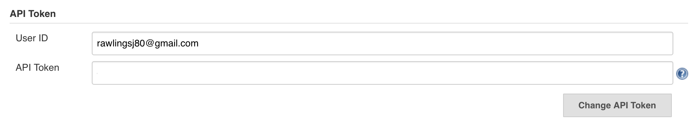

# Test project for fabric8 Jenkins using Godog

This test project connects to a running Jenkins instance and runs a number of feature level tests.  You will need to set some environment variables before running the tests.

Go to http://your.jenkins.io/me/configure, in the __API Token__ section click `Show API Token` and take note of the user id a token values.



Then set the following environment variables:
```
export GINKGO_JENKINS_URL=http://your.jenkins.io
export GINKGO_JENKINS_TOKEN=abcd1234
export GINKGO_JENKINS_USERNAME=jrawlings
```
To run clone this repo and run:
```
go get github.com/DATA-DOG/godog/cmd/godog
go get github.com/fabric8-jenkins/godog-jenkins
cd $GOPATH/src/github.com/fabric8-jenkins/godog-jenkins/jenkins/
```
Now run:
```
godog
```